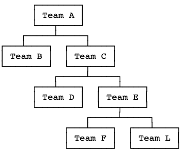

# SIE DevNet Challenge SPA

## Delivery

This repository has been forked and provided specifically for you to use.

To deliver your solution, please create a pull request for your development
branch and get in touch to let us know it is ready for review.

You should also include all the needed instructions on how to run your solution 
[in the bottom of this read me](./README.md#instructions). You can also add any
comments or feedback you deem relevant.

## Objectives

### 1. Display teams and staff data

To begin, your SPA should be able to display existing teams using appropriate
calls to the REST API server.

The end user should be able to select a team to see the team in detail and a
list of staff members who belong to the team.

**[Optional]** The interface should allow the end user to filter the list of teams
by name.

### 2. Display team trees

Teams made available by the REST API have a `parentId` attribute. This attribute
defines which team they are a sub-team of. Teams without a parent team have their
own ID set in the `parentId` attribute, showing they are a _root team_.

We could therefore describe the data held by the API server as a set of _team trees_.
Each tree has a root team which may have child teams, which in turn may have their
own child teams. Teams at any level of the tree may have staff members.

**For this objective, your SPA should provide some view of this tree structure and
a way for the end user to navigate through a team tree.**

For example, the view showing a root team may list the child teams as links, allowing
the end user to navigate to those child teams and view further details. You may also
choose to represent these structures visually.

Visual representation of a hypothetical team tree:

## Instructions
The client is using react with typescript. The logic used for displaying tree is recursion. The `OrgTree` component is calling `OrgTreeChildren` component which, in turn, is again calling `OrgTree` component with correct `givenParentId` and reduced number of `teams`. All the components are present in `src/components` folder. I have added some unit tests in `src/utils/*.test.ts*` files. Instructions of using the app is as follows:

1. Make sure that server is running
2. Navigate to client folder in command line and run `npm install`
3. Run `npm start`
4. Navigate to [http://localhost:8080](http://localhost:8080) in Chrome browser
5. Search for a team name or click a team name to view team members
6. Optional: Run `npm run test` to check if tests are passing or not

Demo:
[http://teamsdemo.mayank.uk](http://teamsdemo.mayank.uk)

Screenshot:

